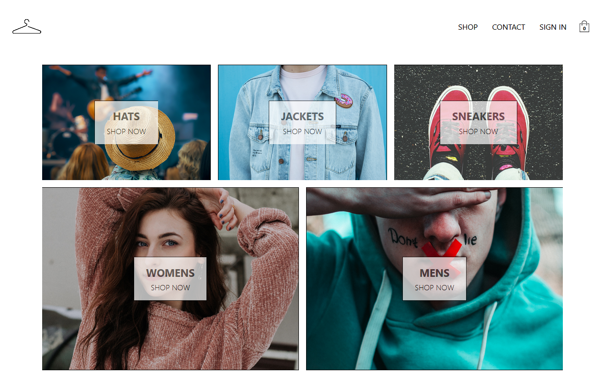

<!-- PROJECT LOGO -->

# **Supremeness (clothing store)**

<!-- ABOUT THE PROJECT -->



<br/>

This is a clothing store with the following attributes:

-   Merchandise display
-   User registration/authentication
-   Shopping cart
-   Payment service

<br/>

### Built With

-   [React](https://reactjs.org/)
-   [Redux](https://redux.js.org/)
-   [React Router](https://reactrouter.com/web/guides/quick-start)
-   [Express.js](https://expressjs.com/)
-   [Firebase](https://firebase.google.com/)
-   [Bootstrap](https://getbootstrap.com/)
-   [Sass](https://sass-lang.com/)

<br/>

<!-- GETTING STARTED -->

## **Getting Started**

<br/>

### Prerequisites

<br/>

```sh
npm install npm@latest -g
```

<br/>

### Installation

<br/>

1.  Create a [Stripe](https://stripe.com/en-gb) and [Firebase](https://firebase.google.com/) account

<br/>

2. Populate the Cloud Firestore database (Firebase) with the following file, `client/src/collections.js`

<br/>

3. Clone the repo

    ```sh
    git clone https://github.com/oneiromancy/supremeness.git
    ```

<br/>

4.  Install NPM packages (start from the root directory)

    <br/>

    Server

    ```sh
    npm install
    ```

    <br/>

    Client

    <br/>

    ```sh
    cd client && npm install
    ```

    <br/>

5.  Create multiple .env files (one at the root and another at the client directory)

    <br/>

    Insert Stripe key in `.env` file of the root folder:

        STRIPE_SECRET_KEY

    <br/>

    Insert Firebase keys in `.env` file of the client folder:

        REACT_APP_API_KEY (apiKey)
        REACT_APP_AUTH_DOMAIN (authDomain)
        REACT_APP_DATABASE_URL (databaseURL)
        REACT_APP_PROJECT_ID (projectId)
        REACT_APP_MESSAGING_SENDER_ID (messagingSenderId)
        REACT_APP_APP_ID (appId)

    <br/>
